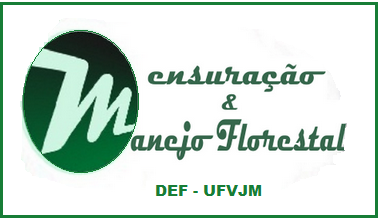

# Teste *F* de Graybill 

Resolvemos desenvolver este app, já que não existe nenhum software atualmente que realize este teste de forma nativa. 

Este teste é muito utilizado, principalmente na área florestal, sendo muitas vezes mais indicado do que os testes de média. Isto porque o teste <i>F</i> de Graybill considera todos os dados, e não só a média, que pode não ser representativa dos dados, principalmente com a presença de outliers. 

A validação da predição constitui-se em ajustar um modelo linear de 1º
grau dos valores preditos em função dos valores observados.

A significância da regressão é avaliada aplicando-se o teste F para as
estimativas dos parâmetros, conforme metodologia descrita por GRAYBILL
(1976):

### Ajude o nosso projeto a se manter no ar!

O projeto foi criado com o intuito de ajudar a comunidade florestal. Para continuarmos a mantê-lo de forma gratuita a todos,
precisamos de doações para cobrir os custos do servidor que mantêm o app disponível. Sua contribuição é de grande ajuda.

## Apoiadores do Mês de Novembro:

 Mariana Miranda Andrade </a>

 Múcio Nepomuceno </a>

 Rauff Barbosa </a>

 Karizen Patriota </a>

 Fernanda Luiza Silva de Oliveira </a>

 Jorge Luiz Mainart </a>

        

  Para contribuir com o nosso projeto, basta clicar no botão abaixo!

<form action="https://www.paypal.com/cgi-bin/webscr" method="post" target="_top">
<input type="hidden" name="cmd" value="_s-xclick" />
<input type="hidden" name="hosted_button_id" value="JVF7VGRMANRC6" />
<input type="image" src="https://www.paypalobjects.com/pt_BR/BR/i/btn/btn_donateCC_LG.gif" border="0" name="submit" title="PayPal - The safer, easier way to pay online!" alt="Faça doações com o botão do PayPal" />

</form>

Conheça nossos outros projetos:
[App Inventário Florestal](http://52.87.251.141/shiny/inventario_app/),
[App Inventário de Nativas](http://52.87.251.141/shiny/nativas_app/),
[App Cubagem](http://52.87.251.141/shiny/cubagem_app/),
[App Economia Florestal](http://52.87.251.141/shiny/forest_economy_app/),
[R package: forestmangr](https://github.com/sollano/forestmangr#readme)

### Desenvolvido por:

[Sollano Rabelo Braga](https://www.linkedin.com/in/sollano/ "LinkedIn"),
[Marcio Leles R. de Oliveira](http://lattes.cnpq.br/1808132114787261 "Curriculum Lattes") &
[Eric Bastos Gorgens](http://lattes.cnpq.br/2266409430041146 "Curriculum Lattes").

#### Para citar e referenciar este app, utilize:

(BRAGA; OLIVEIRA; GORGENS, 2016)

BRAGA, S. R.; OLIVEIRA, M. L. R. DE; GORGENS, E. B. Graybill App: Aplicativo shiny para o teste F de Graybill, 2016. Disponível em: <https://sites.google.com/view/forestsuite/home>.

### Referências:

CAMPOS, J. C. C.; LEITE, H. G. Mensuração florestal: perguntas e respostas. 3ª. ed. Viçosa: Editora UFV, 2013. 605 p.

LEITE, H. G.; OLIVEIRA, F. H. T. Statistical procedure to test identity between analytical methods. Communications in Soil Science Plant Analysis, v.33, n.7/8, p.1105-1118, 2002. 

